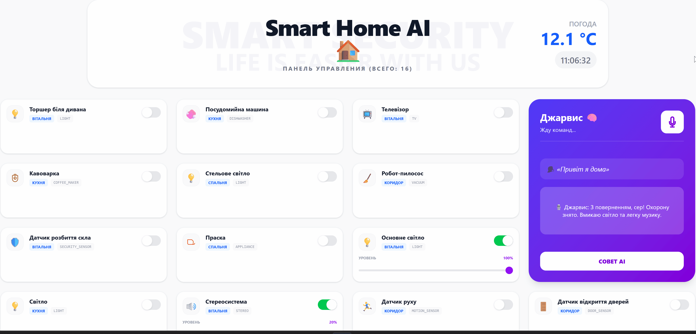

# 🏠 Smart Home AI (Jarvis)

An enterprise-grade smart home system that combines deterministic backend logic with an Agentic AI workflow.  
This is not just a chatbot — it is a real AI agent capable of controlling devices, searching the web, and processing voice commands in real time.

**🔐 Secure by Design:** API keys are *never* exposed to the client. All third-party integrations (LLM, TTS, Search) are handled securely via backend or Next.js server-side routes (BFF pattern).

---

> 🎙️ **Voice-First Experience:**
> Stream your voice via WebSockets directly to the backend. Jarvis uses Whisper STT to understand context, executes agentic loops (like searching the web for current weather), and responds with spoken feedback via TTS.



---

## 🚀 Key Highlights

- 🤖 **Agentic AI Workflow** — LLM can call tools and execute backend logic
- 🎙️ **Full Voice Pipeline** — Speech-to-Text (Whisper) + Text-to-Speech (Cartesia)
- 🧠 **Hybrid Intelligence** — rule-based + AI for maximum reliability
- ⚡ **Fast & Cheap** — optimized for near-zero cost using free-tier APIs
- 🧱 **Enterprise Backend Design** — DTO isolation, transactions, validation

---

## 🧭 System Flow

```text
User (Voice)
        ↓
Whisper STT
        ↓
JarvisService (Orchestrator)
        ↓
AI (Groq LLM)
   ↙          ↘
Tools        Direct Response
   ↓
DB / Search APIs
        ↓
AI Final Response
        ↓
Cartesia TTS (via Next.js Proxy)
        ↓
User hears response 🎧
```

---

## 🔊 Voice Interaction (STT + TTS)

The system supports a full duplex voice interaction:

1. 🎤 **User speaks command**
2. Whisper converts speech → text
3. AI processes request using Agentic Loop
4. Response is generated in Ukrainian
5. 🔊 Cartesia TTS converts text → natural voice
6. **User hears response in real-time**

**Example:**

**User:** "Jarvis, turn on the lights"  
**Jarvis:** "Done, sir. The lights are turned on." (spoken)

✔️ Natural conversation experience  
✔️ No UI required  
✔️ Real assistant behavior

---

## 🔒 Text-to-Speech (TTS) Architecture

To provide high-fidelity voice feedback, the system integrates the **Cartesia TTS API** (Sonic-3 model).

### Secure API Handling (BFF Pattern)
For security reasons, the Cartesia API key is NEVER exposed to the browser. Instead, a Next.js server-side proxy endpoint is used (Backend-for-Frontend):

`Frontend Client` → `Next.js API Route (/api/tts)` → `Cartesia API`

### Implementation
- `frontend/app/api/tts/route.ts` — Server-side proxy handling the actual API request.
- `.env.local` — Stores `CARTESIA_API_KEY` securely on the server.
- `speakJarvis()` — Client-side function that requests the audio buffer and plays it instantly.

---

## 🤖 How the Agentic AI Works

This system uses **Tool Calling (Function Calling)** instead of simple prompting.

**Example tool:**
```json
{
  "name": "control_devices",
  "arguments": {
    "actions": [
      { "deviceId": 1, "targetStatus": "ON" }
    ]
  }
}
```

**Flow:**
1. LLM decides what to do
2. Calls backend function
3. Backend executes logic (DB / API)
4. Result is sent back to LLM
5. LLM generates final response

---

## ⚙️ Hybrid Approach (AI + Rule-based)

**Critical Scenarios (NO AI):**
- "I'm leaving"
- "I'm home"

✔ Zero latency  
✔ Zero cost  
✔ 100% deterministic

**Flexible Commands (AI):**
- "Turn on TV and check the news"
- "What's the weather?"

✔ Context-aware  
✔ Flexible  
✔ Extensible

---

## 🛡️ Resilience & Fault Tolerance

- **Tavily → DuckDuckGo fallback** (no downtime if rate-limited).
- Protection against empty AI responses and missing TTS text.
- Whisper noise filtering (trigger word: "Jarvis").
- Tool loop protection (prevents endless AI tool-calling loops).
- Search result cleaning (truncating to 1000 chars to save tokens).

*System is designed to never fail silently.*

---

## 💰 Cost Optimization Strategy

- Uses free-tier APIs (Groq, Open-Meteo).
- Tavily limited to 990 requests/month with automatic DuckDuckGo scraper fallback.
- Scenario-based commands bypass LLM entirely.
- Fast-path execution for basic device control.

**Result:** Near-zero operational cost with production-ready efficiency.

---

## ❗ What Makes This Project Different

This is **NOT** a simple chatbot wrapper.

✔ Real Agentic Loop  
✔ Backend-controlled logic (not prompt hacks)  
✔ State-aware system (devices, sensors, weather)  
✔ Voice-first architecture with premium Audio  
✔ Deterministic + AI hybrid

This behaves like a real AI agent, not a ChatGPT UI.

---

## 🧱 Tech Stack

**Backend:**
- Java 21
- Spring Boot (Web, Data JPA, Validation, WebSockets)
- PostgreSQL
- Jackson, Lombok

**Frontend:**
- Next.js (React) App Router
- TypeScript
- Tailwind CSS

**AI & Integrations:**
- Groq API (Llama 3.3)
- OpenAI Whisper (Speech-to-Text)
- Cartesia AI (Text-to-Speech)
- Tavily API (Search) / DuckDuckGo
- Open-Meteo (Weather)

---

## ⚙️ Run Locally

**1. Clone repository**
```bash
git clone https://github.com/ilko-ilya/smart-home-ai.git
cd smart-home-AI  
```

**2. Configure Backend environment (`backend/.env`)**
```env
POSTGRES_USER=postgres  
POSTGRES_PASSWORD=your_password  
POSTGRES_DB=smarthome  

GROQ_API_KEY=your_key  
TAVILY_API_KEY=your_key  

WEATHER_LAT=50.51  
WEATHER_LON=30.79  
```

**3. Configure Frontend environment (`frontend/.env.local`)**
```env
CARTESIA_API_KEY=your_cartesia_key
```

**4. Run with Docker**
```bash
cd backend  
docker-compose up -d --build  
```

**5. Open in browser**
```text
http://localhost:3000  
```

---

## 🔮 Future Improvements

- Add Redis caching for weather and AI responses.
- Implement per-user rate limiting for TTS and LLM endpoints.
- Persist Tavily usage counters (currently in-memory).
- Streaming AI text responses over WebSocket.

---

## 👨‍💻 Author

**Ilya Samilyak** | Java Developer