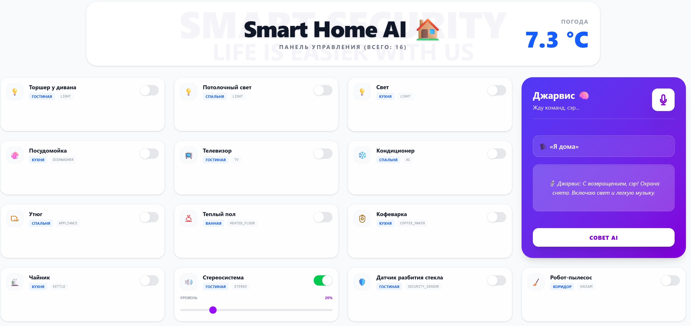

# 🏠 Smart Home AI (Jarvis)

**Smart Home AI** is a modern full-stack smart home application. The project demonstrates how to integrate a Large Language Model (LLM) into backend logic for device control, climate monitoring, and context-aware recommendations using the **Orchestrator pattern**.



---

## 💡 Why This Project Matters (Engineering Challenges)

This project solves several non-trivial problems and showcases system design skills:

- **LLM Integration into Backend Logic:** AI is used not just as a chatbot, but as a functional part of the system
- **AI Response Parsing & Validation:** Reliable extraction and validation of structured JSON from LLM responses
- **Data Orchestration:** Aggregation of data from database (devices), sensors, and external APIs (weather)
- **Voice Control:** Real-time command processing using Web Speech API
- **Hybrid Architecture:** Combination of deterministic logic and probabilistic AI

---

## 🚀 Key Features

### ⚙️ Hybrid Approach (AI + Rule-based)

The system uses a combined approach for maximum reliability:

- **Critical scenarios** ("I'm home", "I'm leaving")  
  → handled by backend logic (without AI)

- **Flexible commands** ("make it comfortable", "turn something on")  
  → handled by LLM (AI)

💡 This approach increases reliability and reduces dependency on external AI APIs.

---

### 🏡 Smart Automation Scenarios

- **"I'm leaving":**  
  security system ON, vacuum ON, all other devices OFF

- **"I'm home":**  
  security system OFF, hallway light ON, music ON (20% volume)

---

### 🧠 AI Assistant (Jarvis)

- **LLM:** Llama 3.1 (via Groq API)
- Analyzes:
  - outside temperature
  - indoor climate
  - active devices

- Generates recommendations for:
  - comfort
  - energy efficiency

---

## 🔗 API Examples

### POST /ai/voice

```json
{
  "text": "turn on kitchen light"
}
```

Response:

```
Done, sir. Devices updated: 1
```

---

### POST /ai/recommendation

Response:

```json
{
  "advice": "Sir, it's quite cold outside. I recommend turning on heating."
}
```

---

## 🧱 Tech Stack

**Backend:**
- Java 21
- Spring Boot 3.2+
- Spring Data JPA
- PostgreSQL

**HTTP Client:**
- RestClient (modern Spring 6 client)

**Frontend:**
- Next.js
- React
- TypeScript
- Tailwind CSS

**AI:**
- Llama 3.1 (Groq API)

**DevOps:**
- Docker
- Docker Compose

---

## 📂 Project Structure

```
smart-home-AI/
├── backend/
│   ├── src/main/java/...
│   ├── docker-compose.yml
│   └── .env.example
├── frontend/
├── README.md
└── screenshot.jpg
```

---

## ⚙️ Run the Project

### 1. Clone repository

```bash
git clone https://https://github.com/ilko-ilya/Smart-Home-AI.git
cd smart-home-AI
```

---

### 2. Configure environment

```
POSTGRES_USER=postgres
POSTGRES_PASSWORD=your_password
GROQ_API_KEY=your_api_key
```

---

### 3. Run with Docker

```bash
cd backend
docker-compose up -d --build
```

---

### 4. Open in browser

```
http://localhost:3000
```

---

## 🚀 Summary

This project demonstrates:

- Full-stack development
- AI integration in backend systems
- Voice control
- System design (Orchestrator pattern)
- DevOps skills (Docker)

---

## 👨‍💻 Author

Ilya Samilyak  
Java Developer